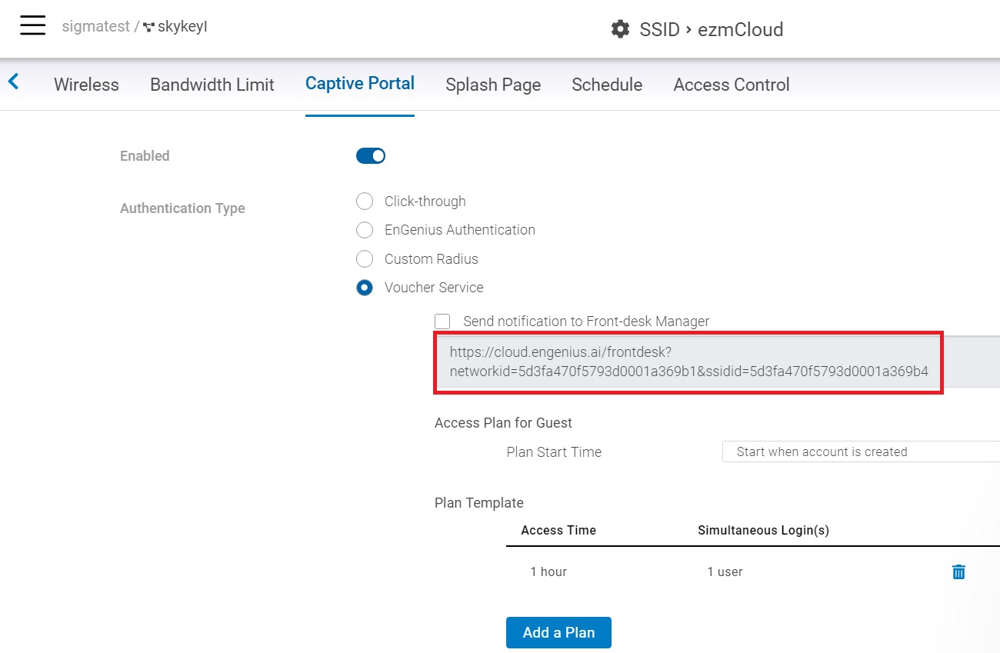
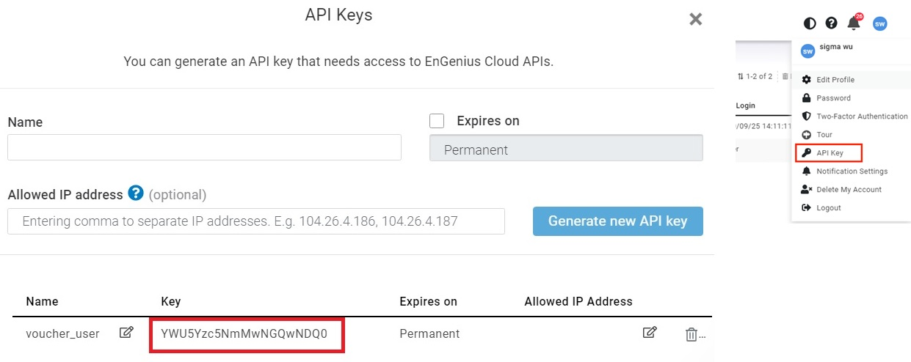
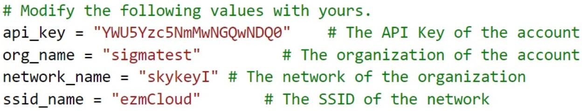

# EnGenius Cloud RESTful API
Documentation: https://liveapi-console-dev.s3-us-west-2.amazonaws.com/engenius_cloud/falcon.html

## Requirements

* Python

## Installation

```console
$ pip install requests
```
## Prerequirement of running voucher_user.py
Before running voucher_user.py, there are some configurations need to be changed in your Engenius Cloud account
- Enable the voucher service and manage voucher users from the URL

- Generate and copy your API key 

- Modify **voucher_user.py**

- Run it
