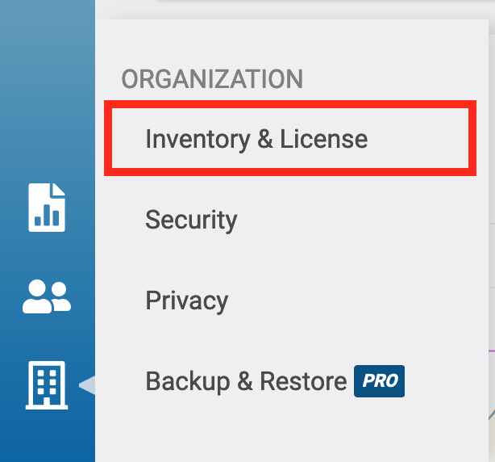
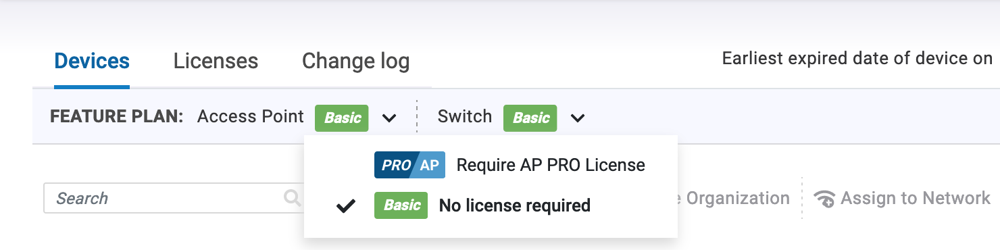
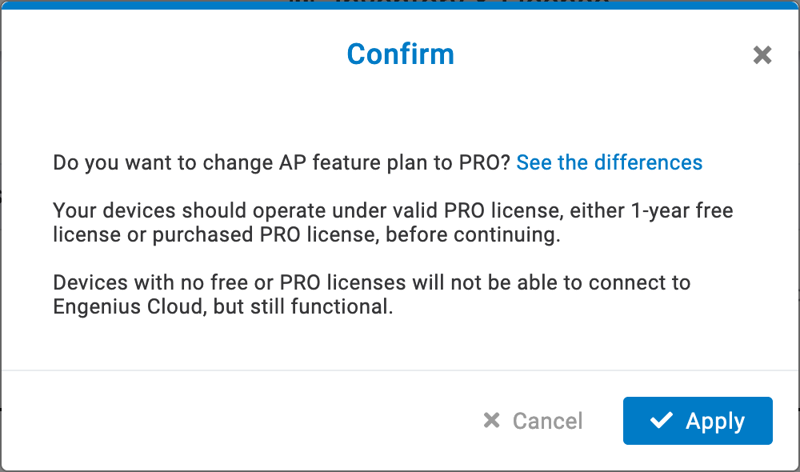
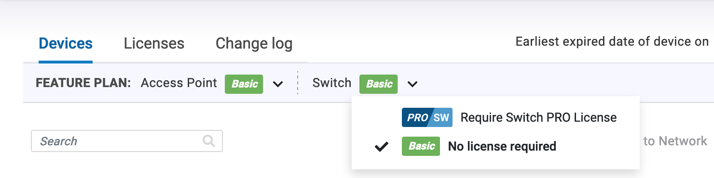
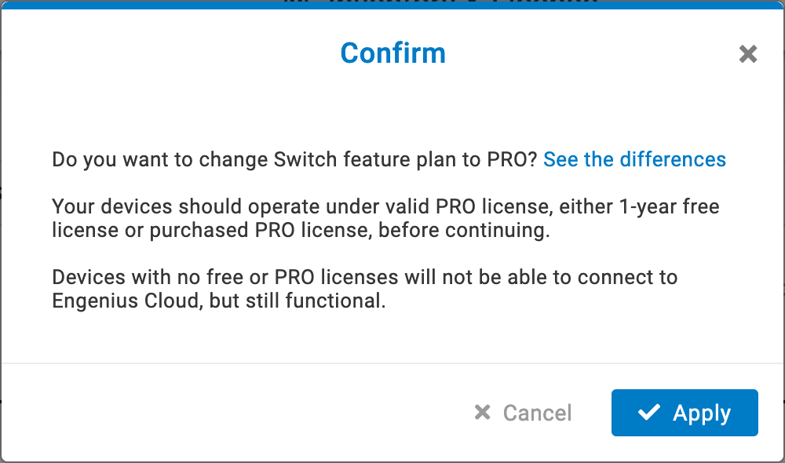
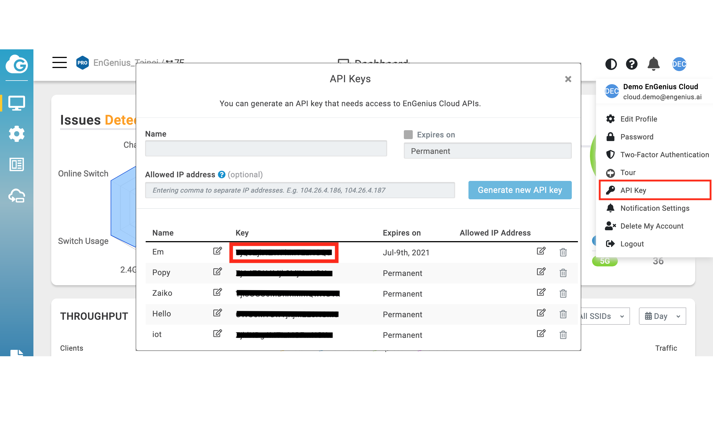
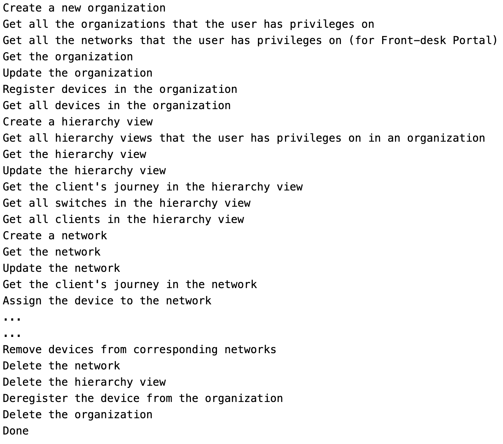

# EnGenius Cloud RESTful API
Documentation: https://liveapi-console-dev.s3-us-west-2.amazonaws.com/engenius_cloud/falcon.html
Note: To call the API, it is necessary to set the feature plan for the API's corresponding device type to Pro; otherwise, the server will return a status code of 402. 

The documentation categorizes APIs into five groups: General, AP, Switch, Gateway, and PDU. Each group corresponds to a specific device type, requiring a Pro feature plan for access. The APIs under the "General" category are accessible with any type of Pro feature plan.

## Requirements

* Python 2.x/3.x (Recommend 2.7/3.8)

## Installation

```
$ pip install -r requirements.txt
```

## Prerequirement of running sample.py
Before running sample.py, there are some configurations need to be changed in your EnGenius Cloud account

- Switch AP/ Switch feature plan to professional license mode  


  - AP  
  
  

  - Switch  
  
    

- Generate and copy your API key  


- Modify **sample.py**
```python
# Modify the following values with yours.
api_key = "YOUR_APIKEY"               # The API Key of the account
org_name = "Test Org"                 # The organization of the account
hv_name = "Test HV"                   # The hierarchy view of the organization
network_name = "Test Network"         # The network of the hierarchy view
serial_number = "YOUR_SERIAL_NUMBER"  # The serial number of the device
ssid_name = "Test SSID"               # The SSID of the network
client_mac = "YOUR_CLIENT_MAC"        # The mac of the client
```

- Run it
```
$ python sample.py
```
