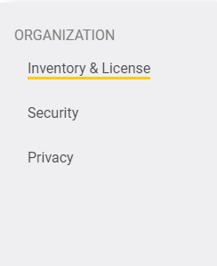
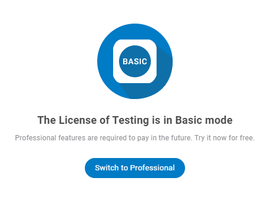
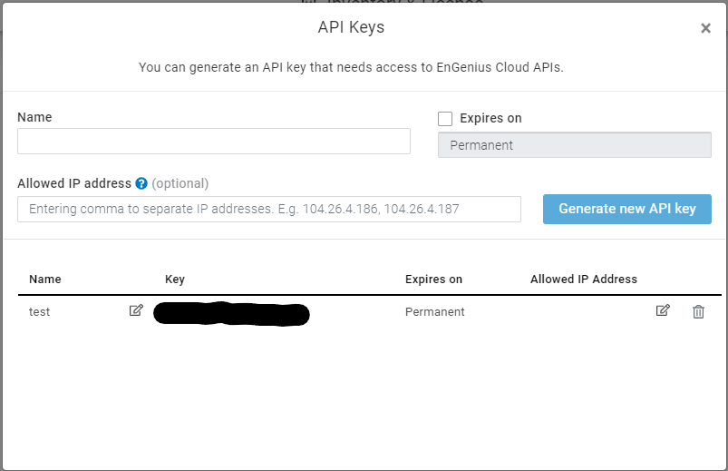
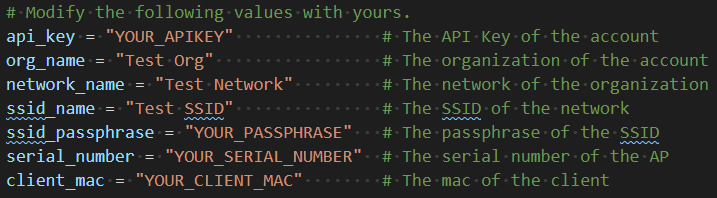

# EnGenius Cloud RESTful API
Documentation: https://liveapi-console-dev.s3-us-west-2.amazonaws.com/engenius_cloud/falcon_vitnett.html

## Requirements

* Python 2.x/3.x (Recommend 2.7/3.8)

## Installation

```console
$ pip install requests
```
## Prerequirement of running sample.py
Before running sample.py, there are some configurations need to be changed in your Engenius Cloud account
- Switch to professional license mode 






- Generate and copy your API key 
  

  
- Modify **sample.py**  
  

  
- Run it 

```console
python sample.py
```